# Lab 050: Setup Cloud Environment

  

## Introduction

In Lab 50 (as Derek) you will initiate the Oracle cloud environment that you will use to create and deploy your microservices applications. This environment will be contained within a cloud Compartment, and communication within the Compartment will be via a Virtual Cloud Network (VCN). The Compartment and VCN will isolate and secure the overall environment. You will deploy two Oracle Cloud Services for this environment. An Oracle Cloud Developer Image will be used to develop and deploy your microservices code. The microservices will access data within an Autonomous Transaction Processing (ATP) Cloud Service.

To deploy these services, you will be using Terraform, a tool for building, changing, and versioning infrastructure safely and efficiently. It is an important tool for anyone looking to standardize IaaS (Infrastructure as a Service) within their organization.

***To log issues***, click here to go to the [github oracle](https://github.com/oracle/learning-library/issues/new) repository issue submission form.

***We recommend that you create a notes page to write down all of the credentials you will need.***

## Lab 050 Objectives

- Log into OCI tenancy.
- Setup your IAAS environment and create common components.
- Create a new Cloud Developer Image from Marketplace.
- Create an Autonomous Transaction Processing (ATP) Database.
- Create an Object Storage bucket.

## Steps

### **STEP 1:** Your Oracle Cloud Trial Account

You have already applied for and received your Oracle Cloud Free Tier Account.

### **STEP 2:** Log in to your OCI dashboard

- From any browser go to oracle.com to access the Oracle Cloud.

    [https://www.oracle.com/](https://www.oracle.com/)

    

- Click the icon in the upper right corner.  Click on **Sign in to Cloud** at the bottom of the drop down.   *NOTE:  Do NOT click the Sign-In button, this will take you to Single Sign-On, not the Oracle Cloud*

       
 
- Enter your **Cloud Account Name** in the input field and click the **Next** button.

  

    **Note this is NOT your email. This is the name of your tenancy noted in the email you received during signup**
- Enter your username (this may be your email address) and password and click on **Sign In**.
  

- Once you log in you will see a page similar to the one below.

      

### **STEP 3:** Download Terraform zip folder

- Grab the first script zip file [here](https://github.com/edercervantes/Script-1-terraform-OCI-for-resource-manager-with-Remote-Exec) and save it somewhere you can find later.

    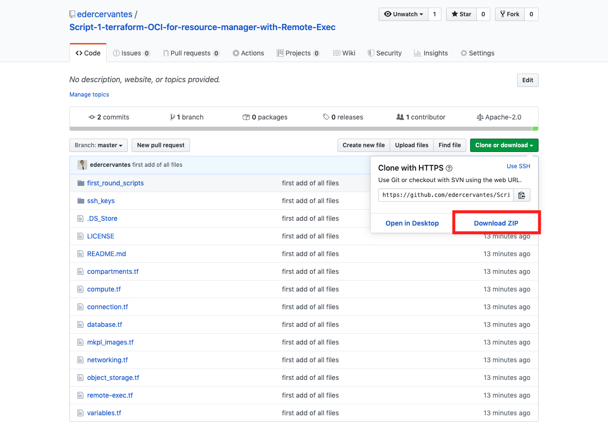

### **STEP 4:** Get Your Oracle Cloud Credentials

To run our Terraform folder in the cloud, we will take advantage of OCI resource manager. It is a powerful tool for planning, and executing multiple Terraform jobs, all without having to installing anything locally. In order for resource manager to create resources for you, it needs to know a few key credentials on the OCI console.

- Click on the profile icon in the top right. Then click into the tenancy link.

  

- Copy the **Object Storage Namespace** in your notes.

  

 ### **STEP 5:** Generate your SSH key pair and prepare first script

 Here we will get out ssh credentials and prepare the first script to be executable.

- On Linux or Mac enter this in a command shell.
    
    `$ ssh-keygen -b 2048 -t rsa`

    You can call the key whatever you want (the default is easiest).  It will create a private key and a public key. The public key is used when you are prompted for a SSH key when you create services, and the matching private key is used to access those services after creation. (eg: Cloud Developer Image).

    

- On Windows, enter this in a command shell.

    `$ ssh-keygen`

    <!-- I can fill out these instructions later -->

- Next, find the first zip file you downloaded and unzip it. Open the ssh_keys folder and note that it is empty. This is because we need to add our private key.

    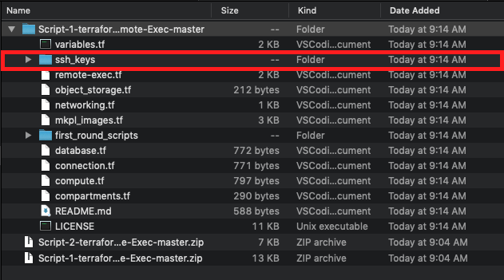

- Go to the location of your private key, then copy and paste it into your ssh_keys folder. Then, open **variables.tf** in any text editor and for the ssh_private_key, add the name of your private key. In our case, we will use `id_rsa`. Save it and close the file.

    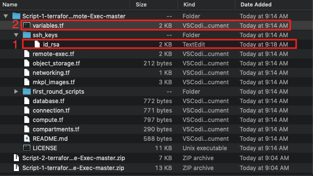

    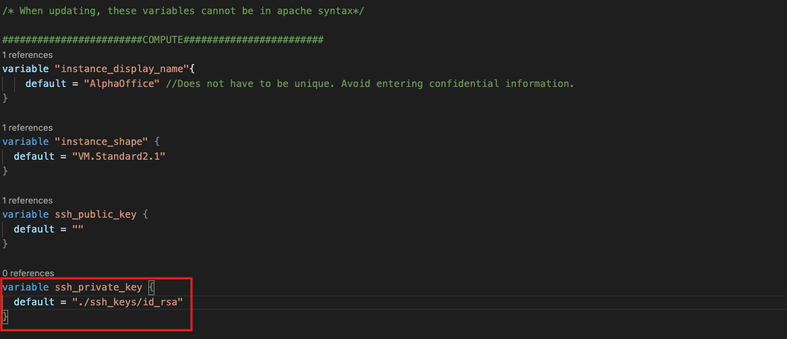

- Now rezip your folder and remove the original zip.

    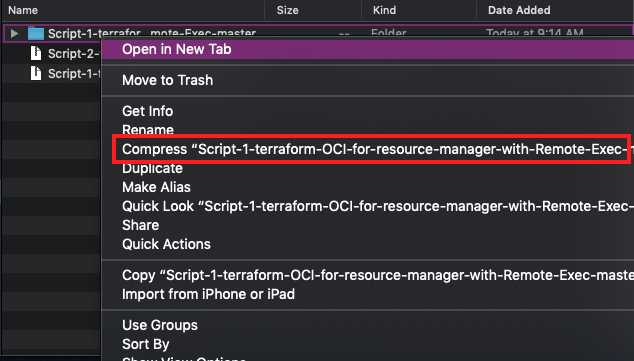

    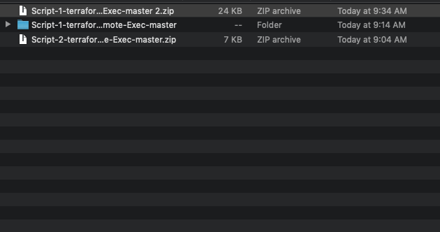

### **STEP 6:** Creating a Resource Manager Stack

Now, we will see the true power of Terraform as opposed to manual creation. By using Terraform, you have a reusable process for creating infrastructure. In some cases, like this one, you don't have to know anything about how the process works. You can deploy different pre-designed infrastructure designs for many different purposes, which frees up users to focus on their projects.

- On the OCI console, click on the hamburger menu and scroll down to **Solutions and Platform**. Hover over **Resource Manager** and click on **Stacks**.

    

- Make sure the **Compartment** on the left side says root. If not, then change it to root. Then, click **Create Stack**.

    

- Drag and drop the zip file you just created earlier into the dashed line box, or click on **Browse** and find it. Then, you can give your **Stack** a name, like `python4dev_script1`. You can also give a description if you'd like, but it is not necessary. Make sure you are still in the root compartment, and using Terraform version 0.11.x. Then click **Next**.

    

- You will see a list of variables that will be used. Find **SSH_PUBLIC_KEY** and paste the public ssh key you created earlier in the given field. **It must be in text format.**

    

- Next, populate the **OBJ_STORE_NAMESPACE** field with the **Object Storage Namespace** credential you saved earlier. Then click **Next**.

    

- Finally, review your variables and make sure everything looks good. Then click **create**.

    
	
### **STEP 7:** Creating OCI resources in Resource Manager

- Now inside of the resource manager, hover over **Terraform Actions** and click on **Plan**.

    

-  You can give the plan a name, or keep the default. Then click on **Plan** to begin.

    

- Wait for the plan to succeed, then click on **Stack Details**.

    

- Again, hover over **Terraform Actions** and click on **Apply**.

    

- You can give the apply a name, or keep the default. You can leave the other settings the same. Then click on **Apply**.

    

- **The apply may take several minutes. Please be patient.**

    

## **STEP 8:** Generate auth token for user

- Navigate to `Identity` > `Users`.  

  

- Select the username of the current logged in userid (yours will be different from the screenshot). Save that name in your notes.

  

- Select `Auth Tokens` on the left, and then `Generate Token`.

  

  

- Copy the token and save it in your notes.  If you lose this you can always generate more tokens.

  

### **STEP 9:** Add data to Object Storage Bucket

- [Click to Download](https://oracle.github.io/learning-library/workshops/python4atp/lab-resources.zip). **Keep track of which directory this zip file gets saved to.**

- Go back to the console, and click the **Menu icon** in the upper left corner to open the navigation menu. Under the **Core Infrastructure** section, select **Object Storage** then **Object Storage** .

  

- Select the **Compartment** `python4dev`.

  

- Your new Object Storage Bucket should show up in the list. Once it appears click on the `py4dev` bucket url to view the details.

  

- Unzip the lab-resources.zip file you copied from earlier.

- Navigate to your object storage bucket and then click **Upload Object**

  

  

- Click **select files**, then select the `expdp_alpha.dmp` and the `credit_scoring_100k_pq`. Note we will be importing data from the `expdp_alpha.dmp` file, and later querying data from the `credit_scoring_100k_pq` (big data parquet file). The latter file will be used in a future lab. This is just showing you how easy it is to query parquet (and avro) files. Click `Open`, then `Upload Objects`.

  

  

  

- Now, select the icon on the far right to retrieve details from `expdp_alpha.dmp`.

  

- Copy the URI (don't download the object) and save it in your notes.

  

- Obtain the URI of the `credit_scoring_100k_pq` file from object storage in your console. Copy the URI path into your notes.

  

## **STEP 10:** Download the Autonmous Transaction Processing Database DB Wallet Zip File

  Click the **Menu icon** in the upper left corner to open the navigation menu. Under the **Database** section, select **Autonomous Transaction Processing**.

  

- Select the **AlphaOffice** Autonomus Transaction Processing Database.  Be sure to select the correct region, and the correct compartment.

  

- Click **DB Connection**

  

- Click **Download**

  

- Enter the **Password** `helloWorld123` and click **Download**

  

- Select `Save File` and Click **OK**

  

- Keep track of where the **Wallet_orcl4py.zip** file was downloaded to.

### **STEP 11:** Upload files to your Marketplace Developer Image

Here we will upload the wallet and lab-resources zip files to the instance. They will be needed by the next script.

- Click on the hamburger menu, and navigate to **Core Infrastructure**. Hover over **Compute** and click on **Instances**.

	

- Click on your image to identify the IP address. Save the IP address in your notes.

	

- Next, open a terminal window and run this command to upload the wallet zip.
    
    `scp -i <path/to/your/private-key> <path/to/your/Wallet_orcl4py.zip> opc@<instance IP address>:/home/opc/atp_wallet`

- Then, run this command to upload the lab-resources zip.
    
    `scp -i <path/to/your/private-key> <path/to/your/lab-resources.zip> opc@<instance IP address>:/home/opc/tmp/lab-resources`
	
    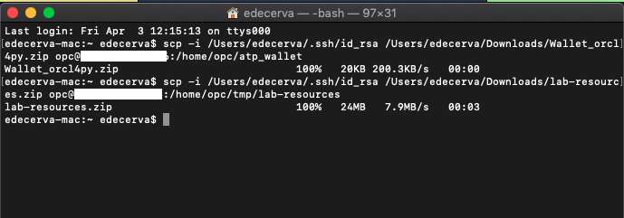

### **STEP 12:** Prepare the second script

- Grab the second script zip file [here](https://github.com/edercervantes/Script-2-terraform-OCI-for-resource-manager-with-Remote-Exec) and save it somewhere you can find later.

    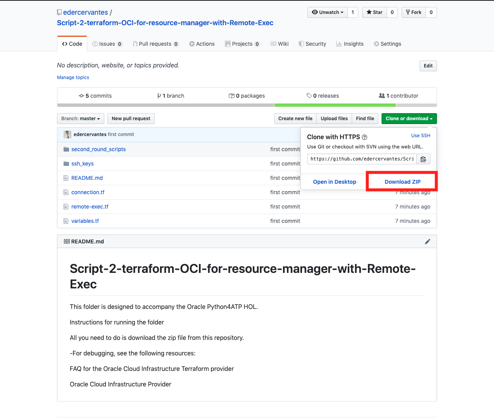

- Unzip it and open the folder.

- Open the **ssh_keys** folder and note that it is empty. This is because we need to add our private key.

    

- Go to the location of your private key, then copy and paste it into your ssh_keys folder. Then, open **variables.tf** in any text editor and for the ssh_private_key, add the name of your private key. In our case, we will use `id_rsa`. Save it and close the file.

- Then, open ocd2atp_connect in any text editor, and change the dumpfile value to your bucket expdp_alpha.dmp url. Save it and close the file.

    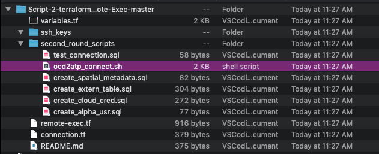

    

- Then, open create_extern_table in any text editor, and change the file_uri_list value to your bucket credit_scoring_100k_pq url. Save it and close the file.

    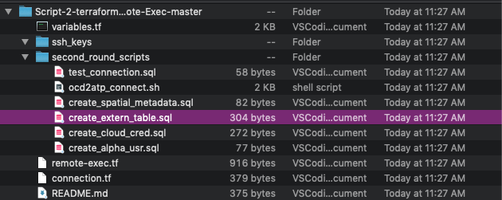

    

- Next, open create_cloud_cred in any text editor, and change the username and password values to the username and token you had saved earlier. Save it and close the file.

    

    

- Now rezip your folder and remove the original zip.

    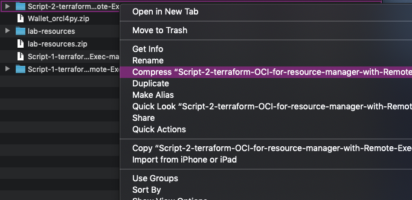

    

### **STEP 13:** Creating a Resource Manager Stack

Now as you will remember from before, we will again run use resource manager to run the second script.

- On the OCI console, click on the hamburger menu and scroll down to **Solutions and Platform**. Hover over **Resource Manager** and click on **Stacks**.

    

- Make sure the **Compartment** on the left side says root. If not, then change it to root. Then, click **Create Stack**.

    

- Drag and drop the zip file you just created earlier into the dashed line box, or click on **Browse** and find it. Then, you can give your **Stack** a name, like `python4dev_script2`. You can also give a description if you'd like, but it is not necessary. Make sure you are still in the root compartment, and using Terraform version 0.11.x. Then click **Next**.

    

- You will see a list of variables that will be used. Find **PUBLIC_IP** and paste the public ip address for your instance in the given field. Then click **Next**.

    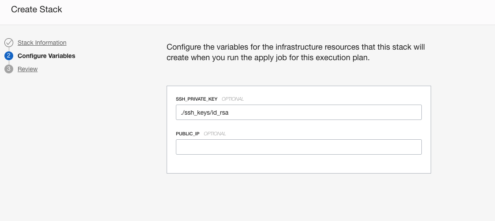

- Finally, review your variables and make sure everything looks good. Then click **create**.

    
	
### **STEP 14:** Creating OCI resources in Resource Manager

- Now inside of the resource manager, hover over **Terraform Actions** and click on **Plan**.

    

-  You can give the plan a name, or keep the default. Then click on **Plan** to begin.

    

- Wait for the plan to succeed, then click on **Stack Details**.

    

- Again, hover over **Terraform Actions** and click on **Apply**.

    

- You can give the apply a name, or keep the default. You can leave the other settings the same. Then click on **Apply**.

    

- **The apply may take several minutes. Please be patient.**

    

### **STEP 15:** Connect to your Marketplace Developer Image

For more information about the Marketplace Developer Image [click here](https://cloudmarketplace.oracle.com/marketplace/en_US/listing/54030984).

- Click on the hamburger menu, and navigate to **Core Infrastructure**. Hover over **Compute** and click on **Instances**.

	

- Click on your image to identify the IP address. You will use this to ssh into the image.

	

    **If you cannot see your instance, make sure you are in the python4dev compartment.**
<!-- 
- **If you are on Linux or Mac, use these instructions.** SSH into the image.
    **Note, if you are on Windows, the instructions are below.**
    Open a terminal window on a Mac or command shell on Linux and enter the following command:

    `$ ssh -i <path/to/your/private-key> opc@<instance IP address>`

	

    **If you have Linux or Mac, you can skip the Windows instructions**

**If you are on Windows, use these instructions**

- Search for and open PUTTY. Then in hostname put 'opc@instance-ip-address'. Make sure the port is 22.

    

- On the left hand menu, under **Connection**, expand **SSH** by clicking the plus sign next to it. Then click on **Auth**. Once in the menu, click **Browse** next to the private key file field.

    

- Choose the private key `alphakey` file you created earlier and open it.

    

- Next, go back to **Session** on the left hand side and click on it. Save the profile with the name 'py4atp_profile'. Finally, click **Open**.

    

- Click **Yes** when prompted.

    

- You now have an ssh tunnel into your instance!

     

**End of Windows instructions**

- Enter `$ vncpasswd` to set your VNC access (make it a secure one!).

	

- Enter `$ vncserver` to start the vncserver.

	

- Enter `$ exit` to go back to your local directory. -->

- Open a SSH tunnel.
    ***NOTE:*** do not close this terminal window.  It maintains the tunnel to the developer image, which we access through VNC.  If for whatever reason the window is closed or you are otherwise logged out (sometimes tunnels drop), then just run this again to log in.
    
    <!-- For Windows, see the Windows ssh instructions above, except, change the ports for connection to 5901. -->

     This example works on Linux and Mac. **Note:** on Linux you will need to be su.

     `$ ssh -i <path/to/your/private-key> -L 5901:localhost:5901 opc@<your IP address>`

    

- Enter `$ vncserver` to start the vncserver.

	

- Open a vnc viewer session.  If you don't already have vnc viewer you can download it [here](https://www.realvnc.com/en/connect/download/viewer/).

    Enter `localhost::5901` into the browser and then press Enter.

    

    Enter the **vncpasswd** password you created earlier. 

	

    Now you have a user interface for your instance.

	

<!-- ### **STEP 9:** Download Files Used in this Workshop

[Click to Download](https://oracle.github.io/learning-library/workshops/python4atp/lab-resources.zip). **Keep track of which directory this zip file gets saved to.**

**These instructions are for Linux and Mac users.**

- Next, open a new terminal window. **It is important that this is a new window, since the session you opened previously must not be closed.**

- Run the command below.

    `$ ssh -i <path/to/your/private-key> opc@<instance IP address>`

    If you are prompted, enter `yes`.

- Run `$ pwd` to view your home path. Then run `$ exit` to go back to your local environment. If your home path is different than the one below, then change it to yours.

    `$ scp </path/to/lab-resources.zip> opc@<instance IP address>:/home/opc`

    If you are prompted, enter `yes`.

    _Now the zip file has been copied into your instance!_

**End of instructions for Linux and Mac users. You can skip the instructions for Windows users.**

**These instructions are for Windows users.**

- Find and open **PSFTP**.

    

- In the terminal window that opens up, enter `open py4atp_profile`.

    

- Next, enter `put </path/to/lab-resources.zip>`

    

    _Now the zip file has been copied into your instance!_

**End of instructions for Windows users** -->

**This completes the Lab!**

**You are ready to proceed to [Lab 200](LabGuide200.md)**
